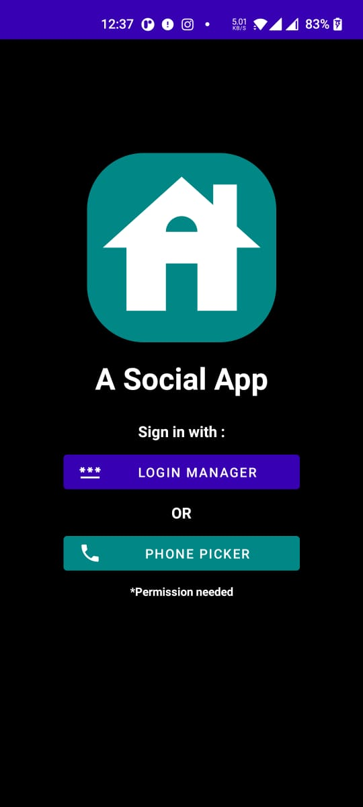
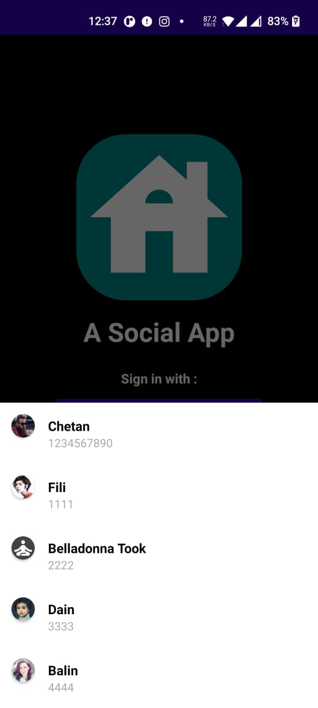
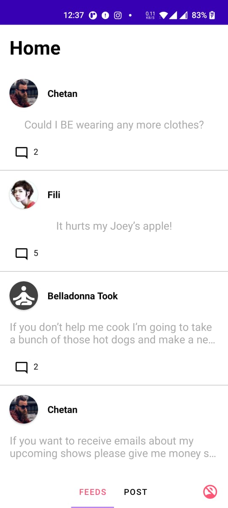
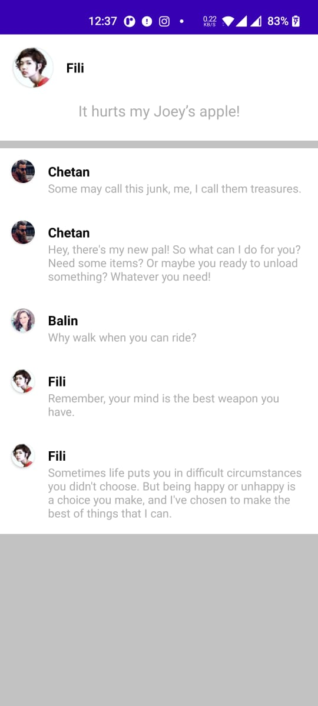

# Social App
Social feed app similar to linkedIn

# Screenshot
<table style="width:100%">
<tr>
 <th></th>
 <th></th>
 <th></th>
 <th></th>
</tr>
</table>

# Demo 
- download link [here](./demo.apk)
- demo video link [here](https://user-images.githubusercontent.com/11576342/119217776-23ca8f80-bafa-11eb-9b69-d523996bd974.mp4)

# Requirements
- [x] Has a fixed set of pre-existing users, say 5 users.
- [x] Allows a user to log in using a phone number and some preset password. 
- [x] The Android system phone number picker is shown to easily pick the phone number.
- [x] Create a  test user - 1234567890
- [x] Each pre-existing user has a set of pre-existing posts (say 0-2 posts per user).
- [x] Each post has a pre-existing text and 0-5 pre-existing comments.
- [x] When a user logs in, he sees a homepage with two tabs: 1) My Feed 2) My Posts
- [x] In “My Feed”, he sees a vertically scrollable list of posts of everyone except his own posts
- [x] In “My Posts”, he sees a vertically scrollable list of his own posts and nothing else.
- [x] In both “My Feed” and “My Posts”, the posts that he sees are truncated versions. 
- [x] Each truncated post shows the name of the owner of the post, some avatar image of him,
- [x] first two lines of the post followed by three dots, and the numeric count of comments on that post
- [x] Clicking on a truncated post takes the user to a details page, where he sees the full post and all comments. 
- [x] logout option 

## :eyes: Social
[LinkedIn](https://bit.ly/ch8n-linkdIn) |
[Medium](https://bit.ly/ch8n-medium-blog) |
[Twitter](https://bit.ly/ch8n-twitter) |
[StackOverflow](https://bit.ly/ch8n-stackOflow) |
[CodeWars](https://bit.ly/ch8n-codewar) |
[Portfolio](https://bit.ly/ch8n-home) |
[Github](https://bit.ly/ch8n-git) |
[Instagram](https://bit.ly/ch8n-insta) |
[Youtube](https://bit.ly/ch8n-youtube)

## :cop: License
Shield: [![CC BY-SA 4.0][cc-by-sa-shield]][cc-by-sa]

This work is licensed under a
[Creative Commons Attribution-ShareAlike 4.0 International License][cc-by-sa].

[![CC BY-SA 4.0][cc-by-sa-image]][cc-by-sa]

[cc-by-sa]: http://creativecommons.org/licenses/by-sa/4.0/
[cc-by-sa-image]: https://licensebuttons.net/l/by-sa/4.0/88x31.png
[cc-by-sa-shield]: https://img.shields.io/badge/License-CC%20BY--SA%204.0-lightgrey.svg

 
NOTE: No features around creating a new post or adding a new comment etc. 
All posts and comments are pre-existing.

